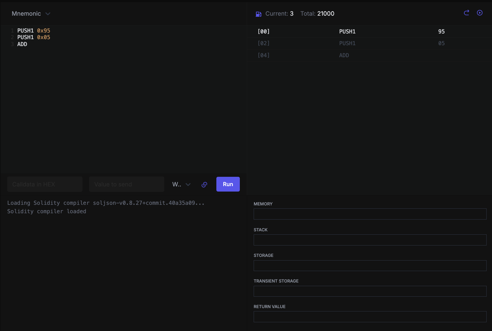
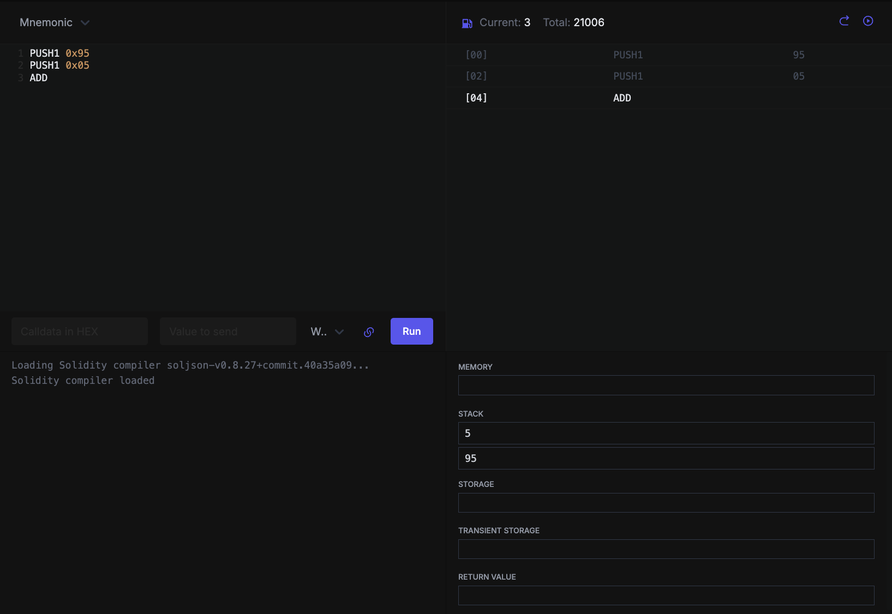
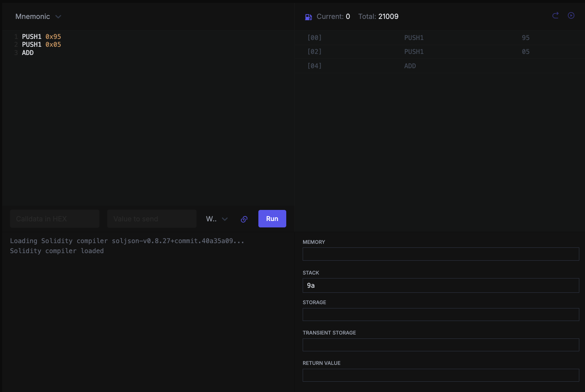

 
I'm still working through the EVM, opcode by opcode. Last time I built `U256` from scratch. This time I hit something that confused me more than it should have.
 
I was modeling a tiny EVM in Rust, and it had three separate fields for data:
 
```rust
struct Evm {
    stack: Vec<U256>,
    memory: Vec<u8>,
    storage: HashMap<U256, U256>,
}
```
 
Three containers for what I assumed was just "data." My question was: why three? I knew RAM had a stack and a heap, so I figured the EVM was doing something similar. It isn't.
 
Figuring out the difference is the thing I actually want to share, because it's the foundation for everything else — once it clicked, reading contracts and thinking about gas stopped feeling like guesswork.
 
## The short answer
 
The EVM has three places to put data. They differ on two things: **how long the data lives**, and **what it costs**.
 
- **Stack** — a tiny scratchpad for computation. Gone when the call ends. Almost free.
- **Memory** — a temporary byte buffer for data too big for the stack. Also gone when the call ends. Cheap, but grows as you use it.
- **Storage** — the contract's permanent records. Survives across transactions, forever. Wildly expensive next to the other two.
The analogy that made it click: storage is a filing cabinet you keep things in between days. Memory is the desk you spread papers across while working — cleared every night. The stack is the few numbers you hold in your head while doing one calculation.
 
The rest of this post is just those three, one at a time.
 
## Stack: where computation happens
 
The stack is where the EVM does its math. It can't add two numbers "in place" — it pushes both onto the stack, runs an instruction that pops them and pushes the result, and that's how every calculation works. It's last-in-first-out, holds at most 1024 items, and each item is a single 256-bit word.
 
Two things define it:
 
It's **tiny and rigid.** You mostly work with the top few items. It's not a place to hold a big blob of data — it's a place to juggle the handful of numbers involved in the current operation.
 
It's **transient and nearly free.** Stack values exist only during the current call and vanish the instant it ends. Pushing and popping costs a few units of gas — essentially nothing.
 
If you write `uint256 sum = a + b;`, that lives entirely on the stack: push a, push b, add, done. No memory, no storage involved.

Let's demonstrate it with an example:

```
PUSH1 0x95
PUSH1 0x05
ADD
```

First, `PUSH1 0x95` puts `0x95` on the stack, and `PUSH1 0x05` puts `0x05` on top of it. The initial gas is `21000` — the baseline every transaction starts with — and each `PUSH1` costs 3 gas, so after both pushes gas is `21006`.

Then `ADD` pops the top two values, sums them, and pushes the result:

`Stack: 0x9a`

`0x95 + 0x05 = 0x9a`. `ADD` costs 3 gas, bringing the total to `21009`. And the whole time, memory and storage stayed empty — pure stack computation.

You can try this in [evm.codes playground](https://www.evm.codes/playground?fork=osaka&unit=Wei&codeType=Mnemonic&code='~95%5Cn~05%5CnADD'~PUSH1%200x%01~_)

<!-- 

Here we have two `PUSH1` opcodes. The first pushes `0x95`, the second pushes `0x05`. After both are on the stack, we use the `ADD` opcode to sum them. Notice the initial gas is `21000` — the baseline every transaction starts with.



As we can see, two numbers are added to stack, and gas is increased by `6` and the current total gas is `21006`, since each `PUSH1` opcode is minimum 3 gas.


After the final `ADD` opcode is executed, we have the final value on stack which is the sum of `95+05`. At the end, we can see that total amount of gas is `21009`. -->

## Memory: a buffer that grows
 
Memory is a flat, byte-addressable array. Unlike the stack, you index into it by byte offset, and unlike the stack, it can hold large things — strings, arrays, the data you're about to hash or return.
 
Two things define it:
 
It's **byte-addressable and expandable.** It starts empty and grows as you write to higher offsets. Write to offset 1000 and the EVM extends memory to reach it. That growth costs gas, so the more memory you touch, the more you pay — but it's still cheap compared to storage.
 
It's **transient, just like the stack.** Memory lives only for the duration of a single call. The moment the function returns, everything in memory is gone. You can't use it to remember anything for next time.
 
So what's it *for*, if it disappears? For the work happening right now that's too big for the stack: building up an array, assembling the bytes you're about to hash, or staging the data a function returns. Anytime you write `uint256[] memory buf` or work with a `bytes`/`string` in a function, that's memory.

Let's see the opcodes in action:

```
PUSH1 0x25
PUSH1 0x00
MSTORE
```

`MSTORE` takes two things off the stack — the offset (on top) and the value below it — and writes the value into memory at that offset. Here's the result:

```
0x00: 0000000000000000000000000000000000000000000000000000000000000025
```

Gas went from `21000` to `21012` — the two pushes cost 3 each, and `MSTORE` cost 6 (3 for the write, plus a little for expanding memory to fit it). Cheap, but not free like the stack: memory has to grow to hold what you write.

I was wondering why we need a full 32 bytes just to store `0x25` when it would easily fit in a `u8`. The reason is that the EVM only has one number type: `U256`. Even a tiny value like `0x25` is stored as a full 32-byte number. This is wasteful, and it's exactly why gas optimization (like packing several small variables into one slot) is a whole discipline in Solidity.

#### A trap I fell into

I tried pushing more values, expecting to store two things:
```
PUSH1 0x25
PUSH1 0x00
PUSH1 0x20
PUSH1 0x01
MSTORE
```

I expected to see both `0x25` and `0x20` in memory. Instead I only saw `0x20`. The reason: `MSTORE` only ever takes **two** values — the top two on the stack. Here that's offset `0x01` and value `0x20`. The `0x25` and `0x00` I pushed first just sat on the stack, untouched. One `MSTORE` writes one value. If you want to store two, you need two `MSTORE`s.

So the final result of this opcode in memory is going to be this:

```
00000000000000000000000000000000000000000000000000000000000000002000000000000000000000000000000000000000000000000000000000000000
```

You can try this example as well on [evm.codes playground](https://www.evm.codes/playground?fork=osaka&unit=Wei&codeType=Mnemonic&code='~25z~00z~20z~01zMSTORE'~PUSH1%200xz%5Cn%01z~_)
 
## Storage: the only thing that lasts
 
Storage is the one region that survives. It's a key-value map — both key and value are 256-bit — and it's where a contract keeps the state that has to still be true in the next transaction.
 
Two things define it:
 
It's **permanent.** Whatever you write to storage stays there across transactions, across blocks, indefinitely. This is where a token contract remembers that you own 50 tokens so it's still true tomorrow.
 
It's **expensive.** This is the part that surprised me most. Writing a fresh value to storage costs on the order of 20,000 gas — versus a handful for a stack operation. That's not arbitrary: a storage value has to be carried by every node on the network, forever. You're not paying for a computation, you're paying for permanence.
 
The classic example is a token balance. An ERC-20 keeps balances in `mapping(address => uint256) balances`, and that mapping lives in storage. When you do `balances[alice] = 50`, that's a storage write; when you read `balances[alice]`, that's a storage read. Those are the operations that survive — and the ones that cost real gas.
 
## One last thing: storage isn't even part of the engine
 
I assumed all three regions would live together inside whatever runs the bytecode, but they don't.
 
[revm](https://github.com/bluealloy/revm) is the EVM implementation built in Rust. Its core [interpreter](https://github.com/bluealloy/revm/blob/main/crates/interpreter/src/interpreter.rs#L31) — the thing that actually executes opcodes — holds the bytecode, the gas counter, the stack, and memory. But it has **no storage field**. Stack and memory live inside the interpreter because they're born and die with a single execution. Storage is reached through a separate interface, because it has to outlive any single execution and is backed by a database.
 
That separation is the whole concept made structural. The transient regions are part of the execution engine; the permanent one deliberately sits outside it. My little `Evm` bundles all three into one struct because it's a teaching model — but the moment I saw a real EVM keep storage at arm's length, the difference I'd been struggling to articulate was right there in the type definition.
 
## What I learned
 
- the EVM has three data regions because they answer two different questions: how long does this live, and what does it cost
- stack and memory are both transient — gone when the call ends — and cheap
- storage is the only thing that persists, and you pay ~1000x more for that permanence
- in a real EVM, storage isn't even part of the execution engine; it sits outside it
This is the foundation. Next I'll keep going through the actual opcodes — `MSTORE`, `SLOAD`, and the rest — in my toy EVM.
 
The code so far is on GitHub: [tskoyo/toy-evm](https://github.com/tskoyo/toy-evm)
